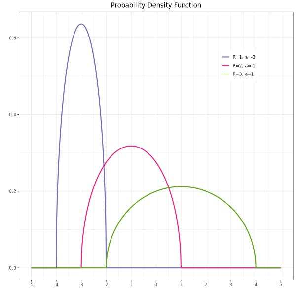
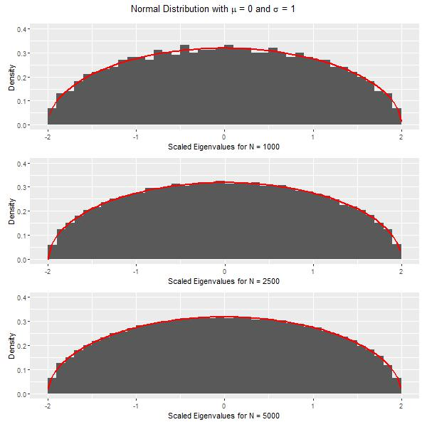

<!-- README.md is generated from README.Rmd. Please edit that file -->

```{r, include = FALSE}
knitr::opts_chunk$set(
  collapse = TRUE,
  comment = "#>",
  fig.path = "man/figures/README-",
  out.width = "100%"
)
```

# semicircledistr

<!-- badges: start -->
[](https://github.com/matthewwhite1/semicircledistr/actions/workflows/R-CMD-check.yaml)
<!-- badges: end -->

The goal of semicircledistr is to simulate the Wigner semicircle distribution.
This package includes the four main distribution simulation functions that other
distributions in R have.

## Installation

You can install the development version of semicircledistr like so:

``` r
devtools::install_github("https://github.com/matthewwhite1/semicircledistr")
```

## Using the Four Functions

Here are some examples of how to use the four main functions included in this
package:

```{r example}
library(semicircledistr)

# Using dsemicircle
# Compute the density at x = 0 for a semicircle with radius 1
dsemicircle(0, R = 1)
# Compute the density for a few x values for a semicircle with radius 2
# shifted 2 to the right
dsemicircle(c(2, 3, 4), R = 2, a = 2)

# Using psemicircle
# Compute the cumulative probability at x = 0 for a semicircle with radius 1
psemicircle(0, R = 1)
# Compute the cumulative probability for a few x values for a semicircle with
# radius 2 shifted 2 to the right
psemicircle(c(2, 3, 4), R = 2, a = 2)

# Using qsemicircle
# Compute the quantile for probability p = 0.75 for a semicircle with radius 1
qsemicircle(0.75, R = 1)
# Compute the quantile for a few probabilities for a semicircle with radius 2
# shifted 2 to the right
qsemicircle(c(0.25, 0.5, 0.75), R = 2, a = 2)

# Using rsemicircle
# Generate 1000 random samples from a semicircle with radius 1
random_samples <- rsemicircle(1000, R = 1)
hist(random_samples,
  breaks = 30, main = "Random Samples from Semicircle Distribution",
  xlab = "Value", ylab = "Frequency"
)
# Generate 1000 random samples from a semicircle with radius 2 shifted 2
# to the right
random_samples <- rsemicircle(1000, R = 2, a = 2)
hist(random_samples,
  breaks = 30, main = "Random Samples from Semicircle Distribution",
  xlab = "Value", ylab = "Frequency"
)
```

## Plots

Here are some plots that can be created with our functions, similar to the
plots found in Wikipedia. The code for creating these plots can be found
in the Scripts folder.


<p>&nbsp;</p>



<p>&nbsp;</p>


<p>&nbsp;</p>


<p>&nbsp;</p>

 
