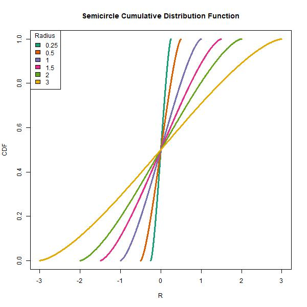

<!-- README.md is generated from README.Rmd. Please edit that file -->

```{r, include = FALSE}
knitr::opts_chunk$set(
  collapse = TRUE,
  comment = "#>",
  fig.path = "man/figures/README-",
  out.width = "100%"
)
```

# semicircledistr

<!-- badges: start -->
[](https://github.com/matthewwhite1/semicircledistr/actions/workflows/R-CMD-check.yaml)
<!-- badges: end -->

The goal of semicircledistr is to simulate the Wigner semicircle distribution.
This package includes the four main distribution simulation functions that other
distributions in R have.

## Installation

You can install the development version of semicircledistr like so:

``` r
devtools::install_github("https://github.com/matthewwhite1/semicircledistr")
```

## Using the Four Functions

Here are some examples of how to use the four main functions included in this
package:

```{r example}
library(semicircledistr)

# Using dsemicircle
dsemicircle(0, R = 1)
dsemicircle(c(0, 0.5, 1), R = 1)

# Using psemicircle
psemicircle(0, R = 1)
psemicircle(c(0, 0.5, 1), R = 1)

# Using qsemicircle
qsemicircle(0.5, R = 1)
qsemicircle(c(0.1, 0.5, 0.9), R = 1)

# Using rsemicircle
rsemicircle(10, R = 1)
rsemicircle(5, R = 1)
```

## Plots

Here are some plots that can be created with our functions, similar to the
plots found in Wikipedia. The code for creating these plots can be found
in the Scripts folder.





