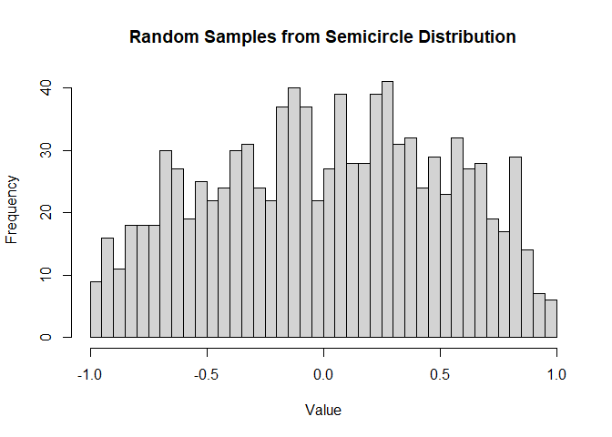
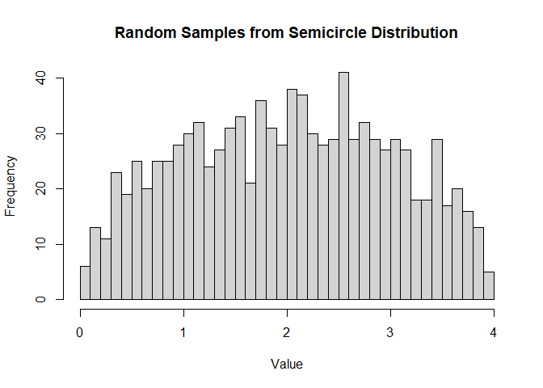

<!-- README.md is generated from README.Rmd. Please edit that file -->

# semicircledistr

<!-- badges: start -->

[](https://github.com/matthewwhite1/semicircledistr/actions/workflows/R-CMD-check.yaml)
<!-- badges: end -->

The goal of semicircledistr is to simulate the Wigner semicircle
distribution. This package includes the four main distribution
simulation functions that other distributions in R have.

## Installation

You can install the development version of semicircledistr like so:

``` r
devtools::install_github("https://github.com/matthewwhite1/semicircledistr")
```

## Using the Four Functions

Here are some examples of how to use the four main functions included in
this package:

``` r
library(semicircledistr)

# Using dsemicircle
# Compute the density at x = 0 for a semicircle with radius 1
dsemicircle(0, R = 1)
#> [1] 0.6366198
# Compute the density for a few x values for a semicircle with radius 2
# shifted 2 to the right
dsemicircle(c(2, 3, 4), R = 2, a = 2)
#> [1] 0.3183099 0.2756644 0.0000000

# Using psemicircle
# Compute the cumulative probability at x = 0 for a semicircle with radius 1
psemicircle(0, R = 1)
#> [1] 0.5
# Compute the cumulative probability for a few x values for a semicircle with
# radius 2 shifted 2 to the right
psemicircle(c(2, 3, 4), R = 2, a = 2)
#> [1] 0.5000000 0.8044989 1.0000000

# Using qsemicircle
# Compute the quantile for probability p = 0.75 for a semicircle with radius 1
qsemicircle(0.75, R = 1)
#> [1] 0.4039794
# Compute the quantile for a few probabilities for a semicircle with radius 2
# shifted 2 to the right
qsemicircle(c(0.25, 0.5, 0.75), R = 2, a = 2)
#> [1] 1.192041 2.000000 2.807959

# Using rsemicircle
# Generate 1000 random samples from a semicircle with radius 1
random_samples <- rsemicircle(1000, R = 1)
hist(random_samples,
  breaks = 30, main = "Random Samples from Semicircle Distribution",
  xlab = "Value", ylab = "Frequency"
)
```



``` r
# Generate 1000 random samples from a semicircle with radius 2 shifted 2
# to the right
random_samples <- rsemicircle(1000, R = 2, a = 2)
hist(random_samples,
  breaks = 30, main = "Random Samples from Semicircle Distribution",
  xlab = "Value", ylab = "Frequency"
)
```



## Plots

Here are some plots that can be created with our functions, similar to
the plots found in Wikipedia. The code for creating these plots can be
found in the Scripts folder.

<figure>

<figcaption aria-hidden="true">Probability density function plot created
with dsemicircle.</figcaption>
</figure>

<p>

 
</p>

<figure>

<figcaption aria-hidden="true">Probability density function plot with
shift parameter.</figcaption>
</figure>

<p>

 
</p>

<figure>

<figcaption aria-hidden="true">Cumulative distribution function plot
created with psemicircle.</figcaption>
</figure>

<p>

 
</p>

<figure>

<figcaption aria-hidden="true">QQ plot created with rsemicircle and
qsemicircle.</figcaption>
</figure>

<p>

 
</p>

<figure>

<figcaption aria-hidden="true">Histograms of Gaussian random matrix
eigenvalues to demonstrate Wigner’s semicircle law.</figcaption>
</figure>
