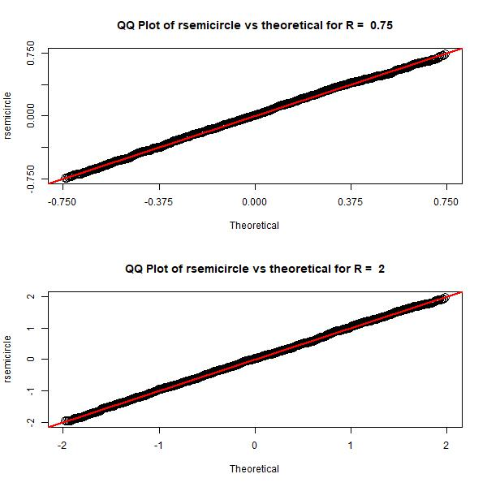

<!-- README.md is generated from README.Rmd. Please edit that file -->

# semicircledistr

<!-- badges: start -->

[](https://github.com/matthewwhite1/semicircledistr/actions/workflows/R-CMD-check.yaml)
<!-- badges: end -->

The goal of semicircledistr is to simulate the Wigner semicircle
distribution. This package includes the four main distribution
simulation functions that other distributions in R have.

## Installation

You can install the development version of semicircledistr like so:

``` r
devtools::install_github("https://github.com/matthewwhite1/semicircledistr")
```

## Using the Four Functions

Here are some examples of how to use the four main functions included in
this package:

``` r
library(semicircledistr)

# Using dsemicircle
dsemicircle(0, R = 1)
#> [1] 0.6366198
dsemicircle(c(0, 0.5, 1), R = 1)
#> [1] 0.6366198 0.5513289 0.0000000

# Using psemicircle
psemicircle(0, R = 1)
#> [1] 0.5
psemicircle(c(0, 0.5, 1), R = 1)
#> [1] 0.5000000 0.8044989 1.0000000

# Using qsemicircle
qsemicircle(0.5, R = 1)
#> [1] 0
qsemicircle(c(0.1, 0.5, 0.9), R = 1)
#> [1] -0.6870235  0.0000000  0.6870235

# Using rsemicircle
rsemicircle(10, R = 1)
#>  [1]  0.7725256  0.9213324 -0.1445707  0.6028919  0.5904718  0.6907625
#>  [7]  0.5364911 -0.4269939 -0.2392605 -0.1947488
rsemicircle(5, R = 1)
#> [1] -0.4082351 -0.4023014 -0.1614472 -0.1564876 -0.8230285
```

## Plots

Here are some plots that can be created with our functions, similar to
the plots found in Wikipedia. The code for creating these plots can be
found in the Scripts folder.

<figure>

<figcaption aria-hidden="true">Probability density function plot created
with dsemicircle.</figcaption>
</figure>

<p>

 
</p>

<figure>

<figcaption aria-hidden="true">Probability density function plot with
shift parameter.</figcaption>
</figure>

<p>

 
</p>

<figure>

<figcaption aria-hidden="true">Cumulative distribution function plot
created with psemicircle.</figcaption>
</figure>

<p>

 
</p>

<figure>

<figcaption aria-hidden="true">QQ plot created with rsemicircle and
qsemicircle.</figcaption>
</figure>

<p>

 
</p>

<figure>

<figcaption aria-hidden="true">Histograms of random matrix eigenvalues
to demonstrate Wigner’s semicircle law.</figcaption>
</figure>
